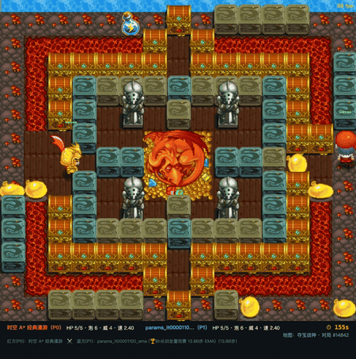
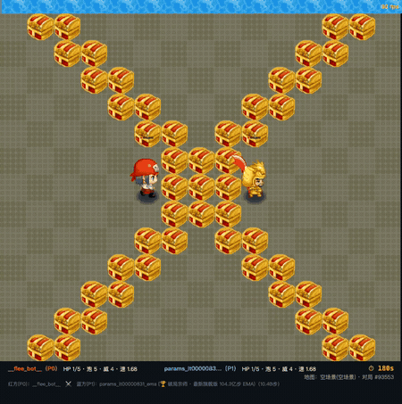
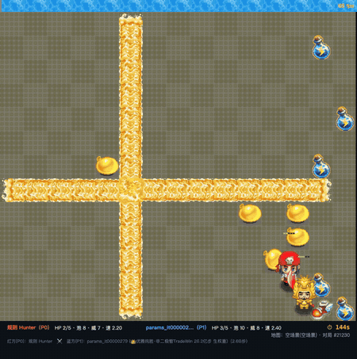
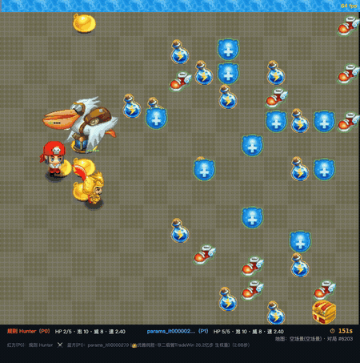
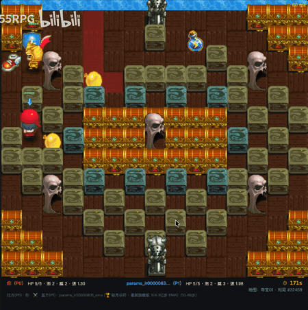
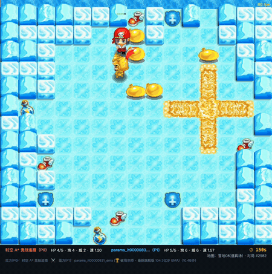

# qqt-gpu-sim — 泡泡堂风格 1v1 格斗：GPU 批量模拟器 + 自博弈 PPO

基于 JAX 的全张量化 GPU 炸弹人环境与分布式强化学习框架，单机/多机集群并行仿真数万环境，通过 7.5M 参数 ViT **纯自博弈** PPO 与多态联赛演化（**全程零人类对局数据**），攻克高水平对峙纳什陷阱，训练具备全图泛化、主动压迫与深度博弈能力的竞技智能体。方案历经 PyTorch MLP/CNN 早期原型验证，现已全面演进至 JAX ViT Transformer 第四阶段破局宗师训练（12 机 × 2 卡 = 24 副本集群，单轮训练量超百亿步）。

### 核心战力评估基准（旗舰模型 params_it00000831_ema）

| 对战对手 | 对手类型与机制 | 全场景标准开荒（241 图）<br>胜 - 平 - 负（不败率） | 开阔地满配残局（纯身法）<br>胜 - 平 - 负（不败率） |
|---|---|:---:|:---:|
| **人类高玩（50 局实测）** | 真实人类深度盲测，考验临场应变与失误捕捉 | 40 胜 7 平 3 负（**94.0%**） | 43 胜 5 平 2 负（**96.0%**） |
| **高级时空 A*** | 多步引信推演、时空 A* 避险与包抄 | 78 胜 14 平 8 负（**92.0%**） | 90 胜 10 平 0 负（**100.0%**） |
| **逃跑拉扯怪（Flee）** | 快速拉开距离、动态避弹风筝逃跑 | 71 胜 20 平 9 负（**91.4%**） | 65 胜 25 平 10 负（**90.0%**） |
| **规则 BFS 猎人** | 全局多源 Dijkstra 追击，高频落泡压制 | 69 胜 37 平 22 负（**82.8%**） | 83 胜 13 平 4 负（**96.0%**） |

> 注：不败率统计为「胜局 + 超时平局」。人类对战 50 局实测中 AI 战绩为 43 胜 5 平 2 负（胜率 86.0%，不败率 96.0%）。人类获胜的两局中，一局源于 AI 在死角窄道落泡自陷，另一局为一血极限残局险胜。

---

## 🎮 试玩（浏览器版）

**▶️ [点这里在线玩 QQT 格斗](https://wukangmh2022-cmyk.github.io/qqt-gpu-sim/)**

原版 `res/` 素材渲染（角色精灵/炸弹/爆炸/场景皮肤/音效），方向键/WASD 移动、空格放泡、支持推箱。模型下拉可选：

- **破局宗师系列**（Patch3 ViT 7.5M）：最新旗舰版 `params_it00000831_ema`（10.43B 单轮 / 17.3B 终生累计步）与稍弱版 `params_it00000223_ema`（2.79B 步），阶段四攻克对峙纳什陷阱与全图泛化；
- **ViTModel2 系列**（JAX ViT，按累计训练步数命名）：`1.1B / 7.5B / 22.6B / 31.9B`（第二次大训练的快照）；
- **Pre-Train Test**（Patch3 ViT 7.5M）：第三次大训练前的试水模型（双卡 30 分钟预训练）；
- torch 时代遗产模型（`duel_course / duel_cnn / duel_nobc` 等）；
- 规则 AI（Hunter、高级时空 A* 等）。

页面含实时 AI 胜率对峙条（Win Probability Gauge）、录像回放与 60FPS 视频导出。

- 本仓库已启用 GitHub Pages（`main@/` 分支直发 `web/`），**push 即自动上线**；
- 本地启动：`bash scripts/serve_web.sh [端口]`（默认 8080，自动增量导出新模型 + 开服）；
- 手动工具链：`.venv/bin/python deploy/export_ckpt.py --verify`（ckpt→web 权重，含前向自检）→ `git add web && git push`；
- 引擎是 `sim/torch_sim.py` 与 `jax_bomb/jax_env.py` 的纯 JS 标量移植（物理步进源自 torch_sim，观测编码/推箱/14 通道对齐 jax_env），与 JAX 参考实现逐元素对拍一致（`quick_check_js_jax_*.py`，60 随机状态 maxdiff < 1e-7）。

---

## 🎥 核心实战与机制演示

强化学习智能体在复杂对战场景中的代表性高阶博弈表现与底层游戏物理机制演示【所有图例使用版本为：params_it00000831_ema】

| 分类 | 实战演示 | 机制解析与博弈技术细节 |
|---|---|---|
| **炸墙与成长**<br>Blast & Loot |  | **炸箱与拾取成长**：常规炸开宝箱并拾取掉落的药水与飞靴道具，提升火力与储泡属性（源自夺宝战神实战）。 |
| **半身连泡**<br>Half-Body Chain |  | **并排连泡压制**：半身拉泡，压制对手并尝试击杀（源自空场景实战）（半身：是 QQ 堂一种高玩技巧，如图位于两个格子正中间。纵向拉泡，自身不会受伤）。 |
| **连泡击杀**<br>Chain Kill |  | **引线瞬燃击杀**：极限时间切入临爆老泡，新泡同时引爆，完成击杀（源自空场景实战）。 |
| **包围泡击杀**<br>Surround Kill |  | **四向闭环合围**：在 ai 自身有速度优势的时候，开阔平地贴身包抄布设四向水泡牢笼，封死全部走位通道完成零封击杀（源自空场景实战）。 |
| **推箱并击杀**<br>Push Box & Kill |  | **推开机关绝杀**：面对阻路机关砖自主前推开辟通道，顺势近身落泡封死退路绝杀（源自夺宝01实战）。 |
| **连续截杀**<br>Continuous Kill |  | **连续压制与击杀**：在窄道持续贴身跟进落泡，连续压迫走位并完成击杀（源自雪地08道具场实战）。 |

> 仓库 `docs/gameplay/` 目录下还收录有中国功夫、游乐场、爱的考验等关卡更多击杀动图。

---

## 实验历程（按时间）

### 阶段一：Torch 批量模拟器 + CNN/LSTM/MLP 课程化 PPO（2026-08-06 ~ 08-15）

**方案**：`sim/torch_sim.py` 纯 PyTorch 全张量化批量对战环境（5632 env 一批，无逐环境循环），网络 MLP 345K（CNN 281K 因 DCU 小卷积慢而落选；LSTM 试验线并存），PPO + **课程化对手管线**：规则 bot 启蒙（random/greedy/astar）→ 固定陪练锚点（rw8/5x2/5x3/cnn 冻结档，ELO 绝对锚定）→ 模型池自博弈。奖励用 71 局人类录像逐 tick 校准；修复了后期"钟摆效应"（熵下限 0.03 破确定性对称均衡）。

**成绩（DCU 实测，corridor 70%，256~512 局/组）**：

| 对战 | v1 纯自博弈（400M 步） | **v2 课程化（230M 步）** |
|---|---|---|
| vs 手写寻路 AI（astar） | 24%（大败） | **85~88%** |
| vs rw8（420M，上一代最强） | 32%（输） | **74%** |
| vs cnn（ring 系最强） | 18.8%（输） | **44.9%**（转平） |

**核心教训**：纯自博弈从近零起步只打"上一版自己"→ ELO 自指学不到强者打法；课程化（规则 bot + 固定锚点 + 池子）样本效率高一个量级。

**副产品**：引擎/算子层优化到 **DCU 36~41k sps**；Ascend 910B 上 Triton 化 danger_map 后峰值 **22.2 万 sps**（N=65536 物理上限）；08-12 浏览器版上线 GitHub Pages（JS 移植 + 原版素材）。

### 阶段二：JAX 重写 + 原版 241 关卡 + 多卡 LSGD（2026-08-17 ~ 08-21）

- **JAX 环境重写**（`jax_bomb/`）：与 torch/JS **逐位对拍一致**（修 5 处环境差异；PPO NaN 根因 = 熵项 0×(−inf)，p>0 门控修复）；obs 13→**14 通道**（ch13=可推箱），实现推箱玩法（JAX↔Web 等效，4 项 quick check 全过）；
- **原版关卡**：QQ 堂原版地图/素材导入工具链接入 **241 张原版关卡**（`levels.json`，含出生点对/可推箱/宝箱率数据）；
- **架构定稿**（2026-08-19 拍板）：transformer(ViT) `embed 392 / depth 4 / patch 4 / heads 4 / FF×4` ≈ **7.46M 参数**；单卡实测 21.8K sps（48.1s/iter）；
- **多卡 LSGD**：Local SGD 有损同步（每 K 个 minibatch 平均一次参数，通信量 1/K），跨机可扩展；`launch_8gpu.sh`（单机 8 卡）与 `launch_10nodes.sh`（10 机×2 卡 SSH 编排）落地。

### 阶段三：ViT 自博弈三次大训练

#### 第一次大训练（2026-08-20 ~ 21，试水）：8 卡 · 500 iter · 4.2B 步

- 配置：crate 奖励 0.5（唯一塑形），无探索/无炸墙/无课程；155k sps，54s/iter；
- headless 行为：放炮 16/局、炸墙 7.1/局、吃箱 3.3/局（it500）——**进化方向健康但极慢**；探索率全线 3-10%，交叉对打 400-1800 tick **100% 平局**；
- 结论（驱动第二次设计）：出生点 3 格死锁（冷启动局部最优）；crate 奖励给的是"吃到"不是"炸墙"，链路型奖励学不会；4.2B 仅 260B 的 1.6%；
- **最大教训：退火窗口拍脑袋会翻车**——crate 退火 500M 步 ≈ 1 小时归零，模型还没学会。教训固化为"退火必须 > 学习周期或完全动态化"。

#### 第二次大训练（2026-08-21 ~ 08-27）：260B 完整配置

- 配置定稿（`docs/vit_train_log.md` §2）：`--fresh` 从头，三路稠密塑形统一乘动态退火 **α = max(0,1−gs/30B) × max(0,1−tanh(1.2×击杀率))**（击杀率上来塑形自动归零，只剩纯胜负）：
  - crate 吃箱 0.5（成长链 bootstrap）
  - 探索 novelty 0.01（本局首达格 +0.01，治踱步）
  - 炸墙 0.05（每炸一砖双方 +0.025，即时正反馈破死锁）
- 主跑道 8 卡（16384 envs，8.39M 步/iter，ITERS=31000 ≈ 260B）；10 机×2 卡 SSH 编排同期就绪；
- 08-26 起以 10 机×2 卡从 it889（7.46B 步）**热启动 48 小时续训**（`launch_warmstart_889_48h.sh`，`--reward-anneal-step-offset` 继承退火进度）；
- 进度：快照拉到 it1504 ≈ 12.6B 步，web 权重按累计步数命名导出（37 档，后精简为 4 档：`1.1B/7.5B/22.6B/31.9B`，最高档 ≈ 260B 的 12%）。

#### 第三次大训练（2026-08-29 启动）：48 卡 · 48 小时

**Pre-Train Test 试水**（双卡 30 分钟预训练，Patch3 ViT 7.5M）先验证 P0 全链路（新奖励/新价值头/课程门禁端到端跑通），其 ONNX 已部署进 web；随后 **24 机 × 2 卡 = 48 卡主训练启动**。

驱动本轮的 P0 改造：
- **零和生命演进奖励**：废除 ±1.5 掉血/±10 击杀/0.001 步罚/超时血差全部人工项；`r = (造成−受到)/5`；
- **HL-Gauss 分布式价值头**：标量 critic → 128 桶分类头（[−1,1]，σ=0.04，交叉熵）；
- **Actor Top-25% 优势过滤 + 优势标准化**；
- **Patch 4 → 3**（25 patch token）；
- **空间课程 + 累积图池**。

### 阶段四：破局宗师与全能泛化训练（2026-09）

**病症诊断（高手对峙纳什陷阱）**：
在后期高水平纯自博弈中，双方均掌握了近乎完美的避险与防守能力。由于在零和环境下靠近对手或放炮伴随极高自伤风险，“在安全距离静止对峙（Idle Standoff）”逐渐演变成纳什均衡的局部死锁——自博弈单局放炮量跌至仅 2.3 颗，对峙挂机率高达 48.6%，遇到逃跑怪（Flee Bot）时因不敢冒险压迫而发生 100% 超时发呆。

**破局组合拳方案**：
1. **多态联赛对手池（League Sparring Pool）**：废除 100% 纯自博弈，重构为混合对手池：
   - 逃跑反击怪（Flee Bot，强化主动追击与合围封路）；
   - 漫游巡逻怪（Roam Bot / Time-A* Roam，打破对称僵持）；
   - 历史自对弈快照池（防策略循环遗忘）；
   - 静态/驻留死靶（保留基础补刀放炮直觉，杜绝把木桩当危险躲避）。
2. **主动进攻与对峙破局机制**：
   - 引入对峙距离衰减势能与动态破局惩罚（长时间不靠近且不放炮则施加微小负反馈）；
   - 空间压迫与封路诱导（当放置的炸弹使敌方可移动合法路径骤降时给予额外奖励）；
   - 开拓与压迫奖励（炸开连通敌方区域的障碍即时赋予正向势能）。

**核心战果（标杆模型 `params_it00000223_ema`，27.9 亿步 / 1h45m）**：

| 指标项 | 破局前（纯自博弈死锁态） | 破局后（`it223_ema` 破局宗师） | 变化幅度 |
|---|---|---|---|
| **对阵逃跑怪超时率** | 100%（50s 抓不到） | **0.0%**（快速堵死歼灭） | 彻底根治追击无力 |
| **高水平自对弈平局率** | >85%（超时和棋） | **0.0%**（必分胜负） | 完全打破镜像对峙平局 |
| **单局静止/挂机率** | 48.6% | **17.2%** | 行动极其果断，压迫感极强 |
| **单局放炮频率** | 2.3 颗 / 局 | **61.3 颗 / 局** | 提升 **26.6 倍**，全图狂暴压制 |
| **241 图泛化适应度** | 易被复杂地形卡住 | 任意地图主动巡航、开荒炸墙、夹人封路 | 全模式全关卡通用 |

---

## 现役训练运行配置（阶段四 · 破局宗师版）

| 项 | 阶段四 · 宗师版（it831，10.43B 步） | 前序底模（it349→aggr419，6.87B 步） |
|---|---|---|
| 拓扑 | 12 机 × 2 卡 = 24 副本（`launch_league_breakthrough.sh`） | 9 机 × 2 卡 = 18 副本（`launch_aggressive_clean.sh`） |
| 负载 | 24,576 envs，minibatch 24,576，epochs 2 | 18,432 envs，minibatch 18,432，epochs 2 |
| 对手池 | 多态联赛（15% 静止木桩 + 15% A\* 猎人 + 10% FleeBot + 60% 自对弈快照） | 纯自博弈 |
| 地图配比 | **仅开阔地**（`empty=0.20,功夫=0.30,比武=0.30,爱的考验=0.20`，合计 1.0，其余 237 图不采样） | **全图参与**（`empty=0.05,功夫=0.25,比武=0.35`，合计 0.65，其余 237 图均分 35%） |
| 域随机化 | 1~5 血全覆盖 + 道具/全速阶梯随机化 | 无 |
| 奖励机制 | win_bonus=10.0, lose_bonus=5.0, trade_win=5.0 | 激进破拆（brick 0.30, step_penalty 0.002, 超时双输 -2.0） |
| 模型 | transformer embed 392 / depth 4 / **patch 3** / heads 4 / FF×4 ≈ 7.5M（14 通道含可推箱） | 同左 |
| 价值头 | HL-Gauss 128 桶，[−20, 20]，σ=1.5，交叉熵 | 同左 |
| PPO | γ=0.995，λ=0.95，clip 0.2，vf 0.5，ent 0.008，Adam 2e-4，Top-25% \\|A\\| 优势过滤 | 同左 |
| 分布式 | Local SGD K=32 / mode=param | 同左 |
| 存档 | `ckpt/` 每 60 分钟；rank0 `ckpt_local/` 每 15 分钟 + EMA(0.995) | 同左 |
| 训练量口径 | **终生累计约 17.30B 步**：底模 it349（2.93B）→ 破拆 aggr419（3.94B）→ 宗师 it831（10.43B） | 底模 it349（2.93B）+ 破拆 aggr419（3.94B）= 6.87B 步 |

监控与管理：`python3 scripts/poll_cluster_and_pull.py`（自动化 12 节点状态轮巡与检查点拉取）；回拉快照即时部署至 `web/models/`。

---

## 做法（现行 JAX 管线速览）

- **模拟器**（`jax_bomb/jax_env.py`）：13×15 网格、10Hz、双玩家 5+2 双头动作；`lax.scan` 全张量 rollout，auto-reset 就地开新局；危险图/推箱/宝箱/引信连锁全部纯张量；与 Web JS 编码逐位对拍（`quick_check_js_jax_*.py`）。
- **网络**（`jax_bomb/jax_net.py`）：ViT 式 patch token + 全局状态向量作 state token（双序列输入），bf16 计算 / fp32 输出；策略头（move 5 × bomb 2，非法动作 −inf 掩码）+ HL-Gauss 分类价值头。
- **训练**（`jax_bomb/multicard_train.py`）：`pmap` 跨卡跨机（`jax.distributed.initialize` + RCCL），rollout→GAE→minibatch PPO→LSGD 周期参数同步；课程/门禁/退火在训练循环里热切换（同 shape 不重编译）。
- **torch 时代遗产**（`sim/` `train/` `play/`）：课程化 PPO + ELO 模型池 + 规则 bot 全套仍在，可复跑（见下方快速上手）。

**在哪儿训练**：

| 环境 | 用途 | 实测 |
|---|---|---|
| **SCNet DCU 集群（DTK 26.04）** | **JAX 正式训练**（第一次 8 卡 → 第二次 2×8/10 机 → 第三次 24 机×2 卡 → **阶段四 12 机×2 卡 = 24 副本**） | 第二次 155k sps/8 卡；阶段四 436k~466k sps/24 卡 |
| DCU 单机（torch 后端） | 阶段一训练/回归 | 36~41k sps（5632 env × 128） |
| BW-1（SCNet 910B） | torch 时代正式训练 | 249k sps（N=16384），见 `docs/bw1_notes.md` |
| 本地 MPS（macOS） | 开发/对拍/验收 | ~2.2k sps |

---

## 快速上手

```bash
uv venv --python 3.12 && uv pip install -r requirements.txt
pytest tests -q                                    # 规则/训练侧/parity 测试

# ── JAX 现役：阶段四 12 机 24 卡联赛破局长训 ──
bash deploy_10node/launch_league_breakthrough.sh                             # 阶段四联赛破局长训一键启动
python3 scripts/poll_cluster_and_pull.py                                    # 集群 12 节点状态轮巡与快照自动拉取
bash deploy_10node/launch_12nodes.sh                                        # 通用 12 机 24 卡启动（nodes_current 驱动）

# ── JAX 单机 8 卡（第一/二次大训练同款）──
bash deploy_10node/launch_8gpu.sh

# ── JAX 本地小规模（单卡 1.5M 参数 MLP 调试/对拍）──
python3 -m jax_bomb.jax_train --num-envs 2048 --num-steps 256 --minibatch 2048 --iters 5

# ── 模型导出 + 无头评估 ──
.venv/bin/python deploy/export_jax_ckpt.py --verify   # ckpt → web JSON
node scripts/headless_test.js --opp self,cross --maps 2 --ep 2
bash scripts/serve_web.sh                             # 浏览器版试玩

# ── torch 时代（阶段一，仍可复跑）──
python -m train.train --backend torch --device cuda --arch mlp --single-stage \
  --map-mode corridor --open-fraction 0.3 --total-steps 1_600_000_000 \
  --warmup-steps 150_000_000 --fixed-opp-prob 0.4 --bot-opponents astar,greedy \
  --time-budget 43200 --explore-anneal --bc-data recordings/ --bc-coef 0.3
python scripts/duel_arena.py --ckpt ckpt/duel_course_*.pt --map-mode corridor  # 对战验收
```

---

## 目录

```
jax_bomb/      现役 JAX 训练栈：jax_env(模拟器) / jax_net(ViT+HL-Gauss) /
               jax_train(rollout/PPO/LSGD) / multicard_train(多卡主循环) /
               levels(241 关卡+出生点对课程) / train_real(长训入口)
deploy_10node/ 多卡部署：launch_league_breakthrough(阶段四 12机24卡现役) / launch_12nodes / launch_24nodes /
               launch_8gpu / launch_10nodes / launch_warmstart_889_48h(热启动) / watch_* / pull_ckpt_local /
               nodes_24x2.example.txt(节点清单模板)
web/           浏览器版（sim.js 引擎 + ViT/MLP 权重 + 原版素材），Pages 直发
               assets/maps/levels.json(241 关卡) + curriculum.json(5 阶段课程)
sim/ train/    torch 时代遗产：批量模拟器 / CNN·MLP·LSTM 课程化 PPO / ELO 模型池
play/          对局核心（duel CLI / 录像回放）
deploy/        ckpt→web 导出（export_ckpt/export_jax_ckpt/export_jax_onnx）
tools/         地图解析与素材转换管线（export_web / mapDesc / qqt_to_levels）
scripts/       headless_test.js(无头评估) / analyze_maps.py(地图统计/课程) /
               quick_check_*(JS↔JAX 对拍) / duel_arena.py(对战矩阵)
docs/          vit_train_log.md(ViT 三轮训练记录) / multicard_lossy_sync.md(LSGD 设计) /
               bw1_notes.md / performance.md
tests/         规则/训练侧/parity 测试
RULES.md       规则唯一权威定义（torch/JAX/JS 三端以此为准）
```

---

## 训练教训

### 仿真模拟器与算子工程

- **万局整批推进而非角色级并行**：单局内仅 2 个角色（1v1），细粒度角色级并行无法发挥 GPU 算力。吞吐核心在于成千上万个独立关卡的全张量无分支推进（JAX vmap / BatchedSim），禁止使用逐环境 Python 循环与动态分支，确保静态计算图零编译抖动。
- **定向探测替代散弹写入（Gather 代替 Scatter）**：危险图判定若由泡泡向外 scatter 写入，重叠格必须依赖原子操作或额外显存缓冲。反向改由每个网格向外定向探测最近威胁，实现只读共享、写入独占与无锁零冲突；连锁爆炸采用定轮同步收敛取代 CPU 动态 BFS 队列，消除执行时延抖动。
- **跨端环境物理逐位对拍（Parity Verification）**：模拟器物理语义任何微小漂移都会导致强化学习策略作弊或失效。JAX 环境与 JS/原版引擎在推箱前缘接触判定、计时保留、泡泡引信时序、半身位安全判定等环节必须通过单元级逐位对拍，杜绝环境漏洞。
- **数值稳定性防 NaN 门禁与负 Loss 定性**：动作空间采用移动与放泡双头因子化解耦，合法掩码作用在 logits 上加负无穷（MOVE_IDLE 与不放泡恒合法），禁止对概率乘零引发 NaN；策略熵计算必须过滤 p 等于 0 项避免 0 乘负无穷出 NaN。同时明确 PPO 训练中策略熵与正优势项自然会带来负 Loss，严禁将其误判为异常中断。

### 环境博弈机制与动力学

- **长时序信用分配与即时塑形解脱冷启动死锁**：放泡到造成伤害链条漫长，随机探索期即时期望回报为负（自伤惩罚远超稀疏收益），策略极易塌缩至出生点 3 格发呆不动的自保局部最优。必须通过开荒炸砖与探索即时正反馈打破冷启动死锁。
- **动态退火与奖励地板（防提前撤火与遗忘）**：固定步数退火窗口极易在技能尚未涌现前过早归零。退火系数必须与实际战力指标（如对局击杀率）联动；同时保留开荒奖励地板（crate_floor=0.10）与掉血爆属性守恒，防范百亿步深水区训练发生发育本能灾难性遗忘。
- **开阔地对峙纳什陷阱与打破镜像对称**：同源自博弈在容错偏高时，主动放泡暴露风险远大于收益，策略必塌缩至安全距离外相互静止对峙。必须引入多态对手联赛池（静态死靶 + 漫游走位 + 智能拉扯）与初始血量域随机化（高比例生死局），击碎镜像对称，强行逼出贴身压迫与截杀本能。
- **观测空间完整性保障（可推箱通道接入）**：环境新增机关交互元素时，必须在张量观测中同步显式注入二值状态通道（ch13）。若仅有物理阻挡而缺少感知通道，策略网络对机关完全盲视，战术推箱行为永远无法自然涌现。

### 超参设计与分布式扩展

- **视觉变换器全局感受野（ViT 架构定稿）**：相较局部卷积或表征受限的 MLP，定稿采用 4 层 4 头 392 嵌入维度的视觉 Transformer（约 7.46M 参数），利用全局自注意力与空间 Patch 标记彻底打通全地图宏观战局感知，为长程走位与复杂迷宫寻路提供表征基础。
- **大规模集群跨机有损同步（Local SGD）**：在高频小 minibatch 场景下，跨机 TCP 网络延迟地板会吞噬绝大部分算力，无损全量梯度同步完全不可行。采用 Local SGD（K=32 周期跨机参数平均）后通信开销近乎为零，集群吞吐利用率最大化，且本地副本的微小参数漂移天然充当了自博弈的多样性探索噪声。
- **长因果时序视野配置（Gamma 与 Lambda 调谐）**：针对连环泡延时引爆与走位封路的博弈特征，将折扣因子 gamma 设为 0.995、GAE lambda 设为 0.95，构建覆盖约 6 至 7 秒的有效时序回溯窗口，确保延迟多波次伤害能准确信用回传至最初的落泡布局动作。
- **混合陪练纯净梯度屏蔽（mask_bot_advantages）**：混入规则 Bot 辅助冷启动与打破对称时，反向传播必须将 Bot 席位优势度强制置零且在 Top-k 优势过滤中彻底剔除，严防策略网络反向学习 Bot 的机械被动轨迹而造成策略污染。

### 已知不足与优化方向

- **决策帧率对人优势与拟真调速（100ms → 200ms）**：当前环境逻辑帧率为 10Hz（单帧决策周期 100ms），AI 前向推理零时延，相比人类 200~300ms 的生理反应时间仍具压倒性的微操与拉扯优势。后续计划降频至 200ms（5Hz）开展演练，留出更符合人类反应机能的博弈窗口。
- **狭窄死局与密集掩体偶发自杀（合法动作掩码自陷过滤）**：在部分出生点狭小封闭或障碍物密集的极端复杂地形下，模型仍有小概率放泡自杀。根因在于 PPO 动作合法性掩码（legal mask）尚未加入多步自陷前瞻判定，未动态过滤“放泡后瞬间无法逃出死胡同”的自杀格。这是已知的小 bug，后续将在掩码层引入单步连通性防死锁判定彻底解决。

> 更完整的逐轮记录：**[docs/vit_train_log.md](docs/vit_train_log.md)**（ViT 三轮参数/坑/监控 checklist）、**[docs/multicard_lossy_sync.md](docs/multicard_lossy_sync.md)**（LSGD 与生产配置决策）、**[docs/performance.md](docs/performance.md)**（引擎/算子优化）。

---

## 协议

本项目采用 [MIT License](LICENSE) 许可协议。
