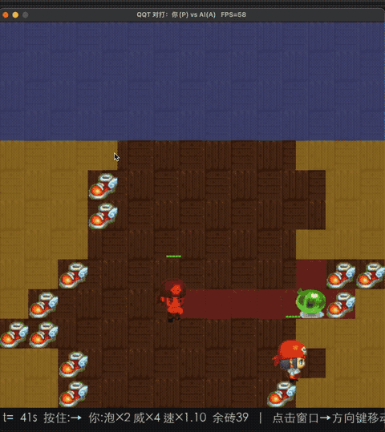
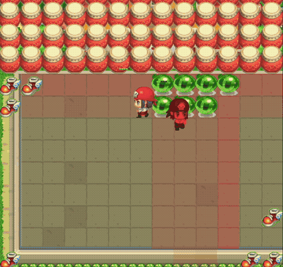

# qqt-gpu-sim — 泡泡堂风格 1v1 格斗：GPU 批量模拟器 + 课程化 PPO 自博弈

一句话：**写一个全张量化的炸弹人模拟器（GPU 一次跑几千局），配合"规则敌人启蒙 → 固定陪练锚点 → 模型池自博弈"的课程管线训 PPO，最后训出能打赢手写寻路 AI 的模型。**

主线是**学习管线**（怎么训出强模型），模拟器是它的地基（把成千上万局塞进 GPU 喂给 PPO）。**当前版本（课程化 v2）已经打赢了自己引入的寻路 AI**，详情见下方"结果"。

---

## 演示

| 对打实况（vs 寻路 AI / 固定陪练） | 人类录像回放（BC 数据来源） |
|---|---|
|  |  |

*录制自真实对局：左 = 模型 vs 寻路 AI；右 = 人类对战回放。完整版见 `play/` 启动器（支持双模型对打 + 人类录像 + 回放）。*

---

## 结果（2026-08，DCU 实测）

| 对战（corridor 70%，256~512 局/组） | v1 直接自博弈（400M 步训完） | **v2 课程化（230M 步，未完）** |
|---|---|---|
| vs 手写寻路 AI（astar） | **24%**（大败） | **85~88%** |
| vs rw8（420M，上一代最强） | 32%（输） | **74%**（512 局） |
| vs 5x2 / 5x3（同线前辈） | — | 90.6% / 96.7% |
| vs cnn（ring 系最强） | 18.8%（输） | **44.9%**（512 局，五五开偏优，从输转平） |

- **行为质变**：学会"时间差连锁"（单次连爆 5x2 的 30.8 → course 的 41 泡）、有一点点封堵概念——v1 训满都不会。
- **速度**：DCU（国产海光，DTK 26.04）上 **36~41k env-steps/s**（5632 env × 128 rollout，MLP）。
- 教训：**纯自博弈从近零起步打"上一版自己"，对手弱且只有自己 → ELO 自指、学不到强者打法；课程化（规则 bot 启蒙 + 固定陪练绝对锚点 + 池子多样性）样本效率高一个量级。**

---

## 做法

### 1. 模拟器（`sim/`）——全张量化的批量对战环境

`BatchedSim`（`sim/torch_sim.py`）纯 PyTorch，一个 batch 跑 N 局，无逐环境 Python 循环。关键设计：

- **观测共享 + 视角置换**：每个 env 只存一份 `(N, C, H, W)` 观测（fp16），"我是谁"通过 `view_perm` 表达成**第一层权重的置换**（MLP 列块 / CNN 通道索引），数据零拷贝。C = 2P+3 + obs_extra = 14（P=2）。
- **危险图通道**：`blast.py::danger_map` 把"哪里会爆、多快爆"直接画进观测（越接近爆炸越接近 1）——躲泡能学出来的关键先验，也是寻路 AI 的原料。
- **因子化双头动作**：move（5 类）× bomb（2 类）独立头，联合 log_prob = 两熵之和 → PPO 公式不用改；`IDLE`/`bomb=0` 恒合法 → 掩码不可能全 inf → 无 NaN。
- **连续坐标 10Hz**：位置是 float 中心 + AABB 碰撞（0.3 格/tick），方向键按住、炸弹键 trigger——人类可执行频率。
- **奖励**：命中 ±1.2、终局按剩余血量差给分（`win_hp_scaled`，反"拿血换命"）、放泡三件套（覆盖/连锁老泡/近身定位，治"啪啪啪连丢"）、爆炸时刻连锁兑现、危险站桩罚、被动罚。

### 2. 网络（`train/model.py`）——MLP 主线，CNN 备选

```
观测 (B, 14, 13, 13) fp16 ──flatten──▶ Linear(2366→128)→LN→ReLU
                                    ──▶ Linear(128→128)→LN→ReLU
            ──▶ move_head(5) / bomb_head(2) / critic(1)     345K 参数
```

- **MLP vs CNN（实战对比）**：两者都试过。CNN（281K 参数，3×3 卷积×3 + 1×1 压缩）在 DCU 上小卷积慢；MLP（345K，全图感受野，危险图已把几何画好）GEMM 更快更省 → **课程主线用 `--arch mlp`**。危险图通道让 CNN 的局部归纳偏置收益有限，MLP 够用且快。

### 3. 训练管线（`train/train.py`）——课程化 PPO

- **对手采样三来源**（每个对手位独立）：
  1. **warmup 期**（`--warmup-steps` 内）：只用规则 bot + 固定 ckpt，不碰模型池——从近零权重先打打得过的；
  2. 之后：`--fixed-opp-prob` 概率用**固定陪练**（rw8/5x2/5x3/cnn 冻结档），否则**模型池** ELO 就近采样。
- **ELO 绝对锚点**：固定陪练走 `fixed_elo` 字典（标准 ELO，k=16，持久化），"打赢 420M"直接体现在 ELO；每 10 iter 独立小 sim 报对 4 家胜率。
- **熵退火按 local_step**（resume 时重新开熵，不跳变）；checkpoint 存全套（网络/Adam/池子/ELO/RNG），原子替换，`--time-budget` 到点自动存盘。

### 4. 仿真敌人（`sim/bots.py`）——全张量化的规则课程老师

不需要寻路 = 不需要逐环境循环：全部策略用危险图 + 距离场打分，5632 env 一个 for 都没有。接口对齐网络 `.act(obs, mmask, bmask, pid)`。

| bot | 逻辑 | 强度 |
|---|---|---|
| `random` | 随机合法移动 + 低概率放泡 | ELO 地板 |
| `greedy` | 朝最近存活对手 Chebyshev 逼近，硬过滤危险格 | 中等 |
| `astar` | **危险度融合价值函数**（见下） | 强（能打赢 400M 模型） |

**astar 原理（一句话）**：把"危险度"融进寻路价值函数——每 tick 用多源 Dijkstra 算两个代价场 `V_safe`（到最近安全格）/ `V_opp`（到最近对手），进入每格代价 = `1 + 2×danger`，墙/砖/在场泡泡都是障碍；决策沿价值函数最速下降（危险→逃、安全→逼近），放泡条件是"打得到对手或能连锁老泡，且放完能撤"。它教给 learner 的正是 v1 学不会的能力：**撤退、时间差连锁、封堵**。

---

## 性能优化

**引擎层面（怎么把几千局塞进 GPU）**：N 局并行（不是 N 角色并行，`--num-envs 5632`
整批张量运算，无逐 env 循环）· 共享观测（每 env 一份 `(N,C,H,W)`，写入量 -84.7%）
· 视角置换吸收进第一层权重（零拷贝）· fp16 观测（写入带宽 + buffer 显存双省）·
内存守卫（启动前按 minibatch 算峰值，超预算拒绝启动）。

**算子层面（单个算子怎么写才快）**：危险图 gather 不 scatter（零 atomic）· 连锁爆炸
固定轮数同步迭代（无 early-exit，CUDA graph 兼容）· SoA 布局 env 最内层（warp 访存
合并）· 掩码作用在 logits（-inf）非概率乘 0（无 NaN）· 合法采样 cumsum 技巧（零 CPU
同步）· 渲染静态层整图缓存。

**实测**：DCU 36~41k sps（astar 每 tick 两场 Dijkstra 也不拖慢，见下）；模拟占训练
总时间 <1%，瓶颈是网络前向 + PPO 更新。

> 完整版（含代码位置、量化、老 CUDA 基准指引）：**[docs/performance.md](docs/performance.md)**

---

## 在哪儿训练

| 环境 | 用途 | 实测 |
|---|---|---|
| **DCU（国产海光，DTK 26.04）** | **正式训练**（torch 后端，cuda 设备） | **36~41k sps**，12h ≈ 1.6B 步 ≈ 180 万局 |
| 本地 MPS（macOS） | 开发/回归/验收对战 | ~2.2k sps，够跑 256 局验证 |

DCU 注意事项：每个 ssh 会话要 `source /opt/dtk-26.04/env.sh` + 设 `OPENBLAS_NUM_THREADS`；训练用 `--backend torch --device cuda`。

---

## 快速上手

```bash
uv venv --python 3.12 && uv pip install -r requirements.txt
pytest tests -q                                    # 113 个测试（106 pass + 7 skip）

# 训练（12h 课程主线，DCU 上跑）：
python -m train.train --backend torch --device cuda --arch mlp --single-stage \
  --map-mode corridor --open-fraction 0.3 --total-steps 1_600_000_000 \
  --warmup-steps 150_000_000 --fixed-opp-prob 0.4 --bot-opponents astar,greedy \
  --fixed-ckpt rw8=private_data/duel_rw8.pt --fixed-ckpt 5x2=... \
  --fixed-ckpt 5x3=... --fixed-ckpt cnn=... --time-budget 43200 \
  --ckpt private_data/duel_course.pt --log-csv private_data/train_course.csv

# 试玩（图形启动器，AI 下拉最上面可选规则 bot / 模型）：
python -m play.launcher            # 人机对打 / AI vs AI 观战
python -m play.duel --ckpt ckpt/duel_course_*.pt --opp-bot astar   # CLI 直开 vs 寻路 AI

# 对战验收（corridor 70%，256 局/组）：
python scripts/duel_arena.py --ckpt ckpt/duel_course_*.pt --map-mode corridor
```

---

## 目录

```
sim/           模拟器：config(规则常量) / torch_sim(BatchedSim) / blast(火焰·危险图)
               obs(观测·掩码) / move(连续碰撞) / mapgen·levelgen(地图) / bots(课程敌人)
               cuda/  CUDA kernel（未来提速选项，训练未用）
train/         model.py(ActorCritic MLP/CNN) / ppo.py(PPO) / train.py(课程主循环)
               model_pool.py(池子+ELO) / curriculum.py(旧阶段表)
play/          启动器 + 对局（选 bot/模型 对战·观战）
scripts/       验收：duel_arena.py(对战矩阵) / sanity_curriculum.py / acceptance_5x3.py
bench/         吞吐/roofline 老基准
docs/          性能优化详解（引擎层 + 算子层）
tests/         113 测试：规则、训练侧、bots、parity(CUDA)
levels/        96 张预生关卡（地图泛化弹药，待 --map-pool 接入）
RULES.md       规则唯一权威定义（两个后端以此为准）
```

---

## 已知边界（下一步）

- **ring 地图未训练**（`ring_fraction=0`）→ 在环岛图上全线溃败（对 greedy 仅 1.2%）；观测无地图标记、零样本泛化。用户明确**不要 ring**，要的是**同语义多布局**泛化。
- **地图泛化**：`levels/` 96 张预生关卡（corridor 骨架随机变体，BFS 校验无死区）已就绪未接入。下一轮续训加 `--map-pool levels/`（batch 内每 env 每局随机抽卡）。
- **cnn 仍打不过**（corridor 39.5%）——ring 系最强，最终验收硬指标。
- 终局奖励已改为按剩余血量给分（`win_hp_scaled`），**下一轮训练生效**（本轮进程跑在内存里，未受影响）。

## 经验教训（踩坑记录）

- **启动器人类交互层必须与测试逻辑同源**：duel.py 玩家帧级移动（60Hz 直接改 sim.pos）
  曾让 AI 在真实对局里表现异常（看似"对静止对手自杀"）；合并玩家模式
  （P0/P1 各自可选 人类键盘/规则bot/模型，`--opp-bot idle` 静止靶对照）后现象消失
  —— 人类移动与 AI 决策分层清晰，AI 不再被私有逻辑喂到分布外的局面。
- **规则 bot 当"对照实验"极好用**：`--opp-bot idle` 验证模型其实**会**打静止靶
  （奖励"炸到人就有分"自然教会）—— 修正了"课程缺静止敌人所以不会打"的误判。
  排查行为问题先跑规则bot 对照，别急着怪训练。

